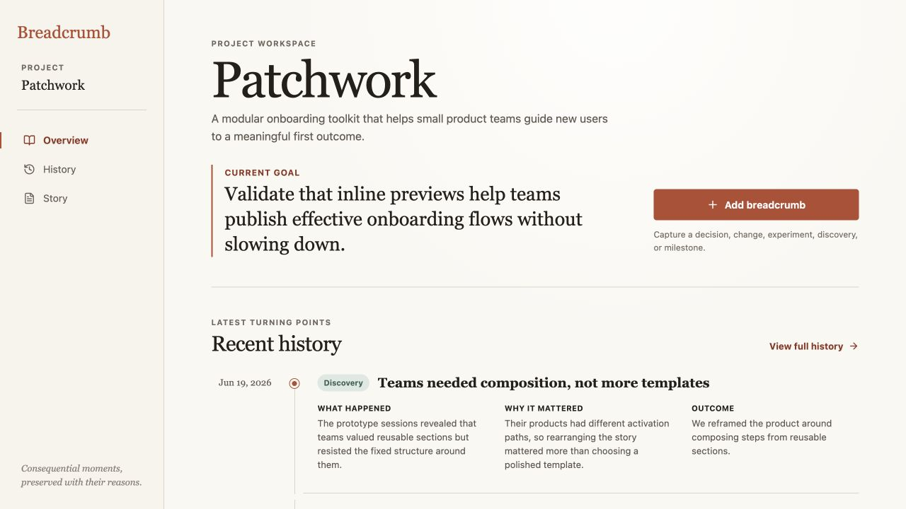
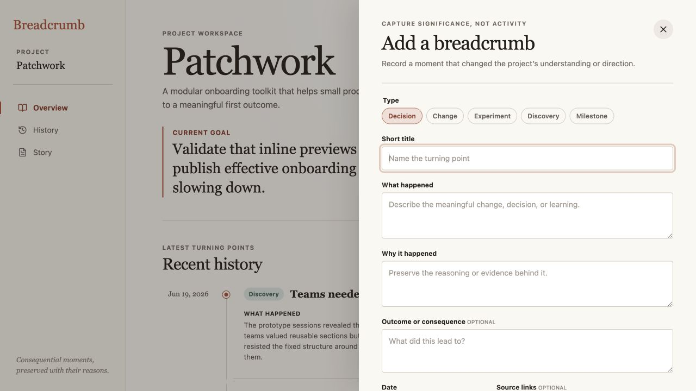
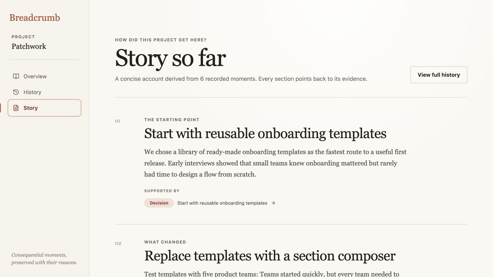
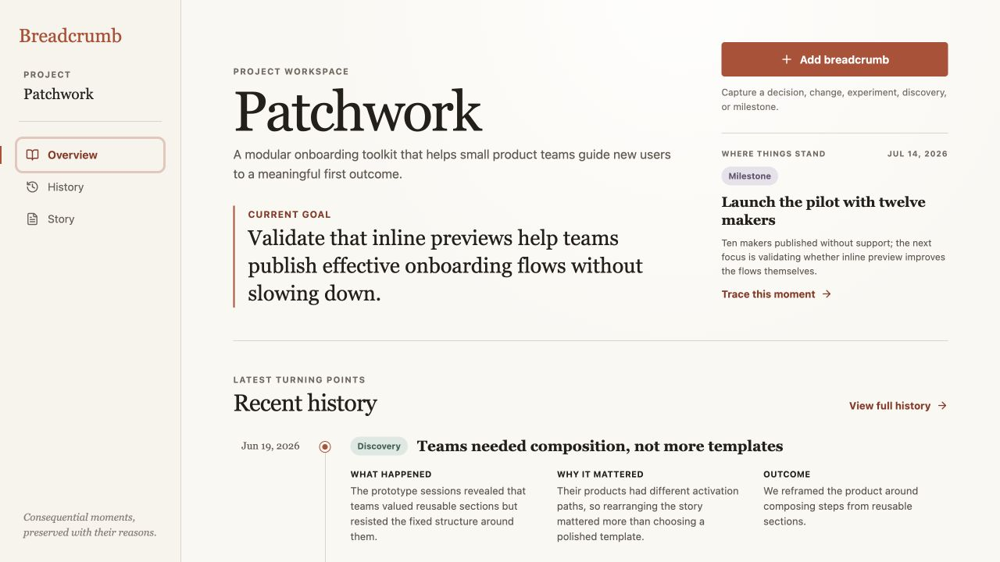

# Breadcrumb product audit — iteration 1

## Scope

Combined UX and visible accessibility review of the seeded Patchwork flow at a 1280 × 720 desktop viewport: orient on the overview, open breadcrumb capture, and read the traceable project story.

## User goal

Return to a fast-moving project, understand its current direction and the evidence behind it, then record or trace a meaningful project moment.

## Steps

### 1. Project overview — needs orientation improvement

The current goal and primary capture action are clear, calm, and easy to scan. The key weakness is that “Recent history” begins with the oldest item in its four-entry slice. At this viewport the latest milestone and its outcome are below the fold, so the visible evidence does not explain the current goal.

### 2. Breadcrumb capture — healthy with one friction point

The form strongly reinforces significance over activity, preserves “why,” and keeps the fixed types understandable. The primary save action sits below the first viewport; this is acceptable for a considered capture flow, but a later iteration should test a sticky action footer or tighter vertical spacing.

### 3. Story so far — healthy and traceable

The editorial hierarchy makes the narrative easy to read, and each claim exposes its supporting breadcrumbs. The middle synthesis is mechanically concatenated rather than explicitly causal; improving how one moment leads to the next is a future project-memory opportunity.

## Highest-value improvement

Add a compact, traceable “Where things stand” cue beside the current goal. It should surface the latest breadcrumb’s outcome and date above the fold, then link directly to that source in History. This improves resumption and orientation without changing the data model, adding a dashboard, or disturbing the chronological record.

## Visible accessibility notes

- Heading order, landmarks, labels, dialog semantics, and source buttons are present in the inspected DOM.
- Primary text and controls have strong visible contrast; muted metadata and small uppercase labels should receive a measured contrast check later.
- Screenshots cannot prove complete keyboard behavior, focus containment, screen-reader output, zoom resilience, or WCAG conformance. Those require interaction and automated/manual accessibility testing.

## Iteration outcome

The overview now keeps the current goal, latest milestone, its outcome, and a source-tracing action in the first viewport. The full history remains chronological. Browser verification confirmed that **Trace this moment** opens History and scrolls the Jul 14 milestone into view.
