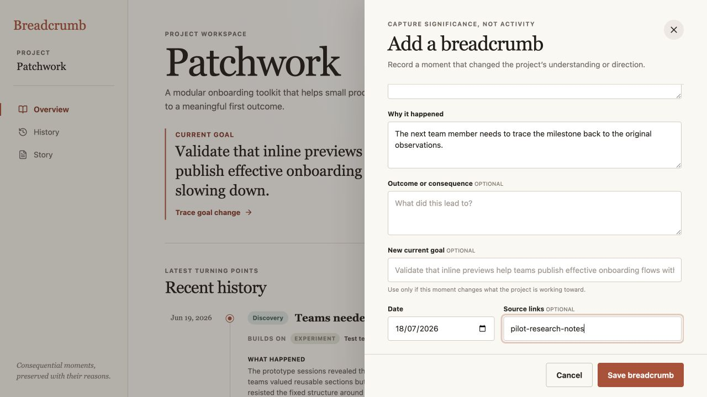
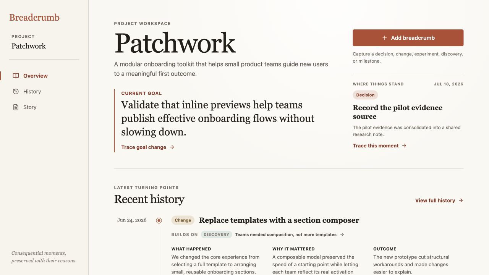
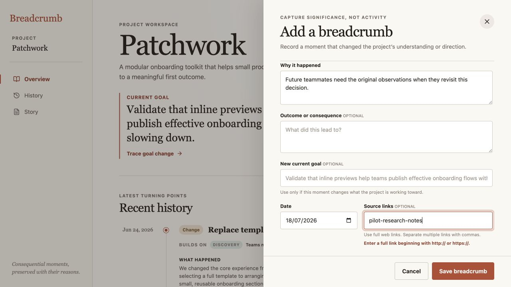

# Breadcrumb product audit — iteration 10

## Scope

Focused UX and accessibility review of adding source evidence while capturing a breadcrumb.

## User goal and accessibility target

Attach trustworthy evidence to a consequential moment, recover from an incomplete link without losing the rest of the form, and confirm that the source became part of project history.

## Steps

### 1. An incomplete source looked saveable — needs attention

The optional source field accepted `pilot-research-notes` without guidance about a required scheme or any visible validation state. The primary action remained available and gave no indication that this evidence would be discarded.

### 2. Save reported success after losing the source — critical

The drawer closed and the moment became the latest project state, communicating a successful capture. DOM inspection confirmed the saved breadcrumb had no Sources section, so the evidence disappeared behind a success state with no recovery path.

### 3. Invalid evidence now stays recoverable — healthy

Saving an incomplete link now keeps every field intact, scrolls and focuses the source field, marks it invalid, and explains the accepted format beside the value that needs repair. The fixed action area remains visible without covering the message.

### 4. Corrected evidence becomes traceable history — healthy

Correcting the link saves the moment with one normalized source, even when the same URL was pasted twice. Tracing the latest moment reveals the source directly on the marked History entry.

## Accessibility notes

- The invalid input uses `aria-invalid="true"` and references both persistent guidance and the error message through `aria-describedby`.
- The error is exposed as an alert and the field receives focus, while color remains a secondary signal.
- The user’s title, reasoning, date, and source text remain in place after validation fails.
- Screenshot and DOM evidence do not establish complete screen-reader announcement order, zoom resilience, or WCAG conformance.

## Iteration outcome

Breadcrumb now treats evidence as project memory that must be preserved explicitly, never silently filtered out of an otherwise successful capture.
