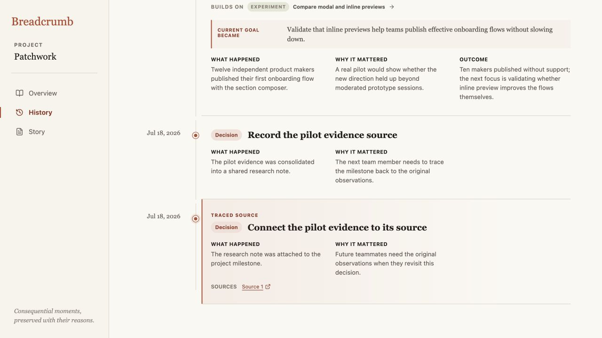
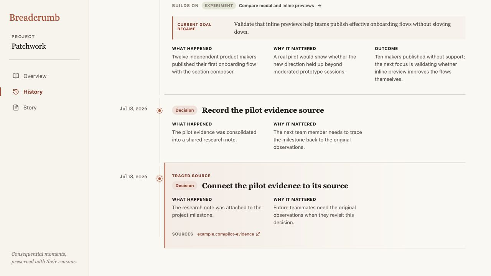

# Breadcrumb product audit — iteration 11

## Scope

Focused UX and accessibility review of how saved evidence is named on a traced History entry.

## User goal and accessibility target

Recognize where a source link leads before opening it, while retaining the full destination and new-tab behavior for assistive technology.

## Steps

### 1. The evidence existed but was anonymous — needs attention

**Source 1** confirmed that evidence was attached but revealed nothing about its destination. A teammate comparing several breadcrumbs or several sources would have to open each link to understand what it represented.

### 2. The destination is recognizable in place — healthy

The same evidence now reads **example.com/pilot-evidence**, preserving the quiet source row while exposing both origin and path. The full URL remains the target and native title, and the accessible name includes that the link opens in a new tab.

## Accessibility notes

- The source remains a native anchor with its complete `href`, `target="_blank"`, and `rel="noreferrer"` behavior.
- Screen-reader text announces the new-tab behavior instead of relying on the external-link icon.
- Long visible labels truncate through CSS without shortening the DOM text or destination.
- Screenshot and DOM evidence do not establish complete screen-reader announcement quality, zoom resilience, or WCAG conformance.

## Iteration outcome

Source evidence is now identifiable project memory rather than an anonymous attachment count.
