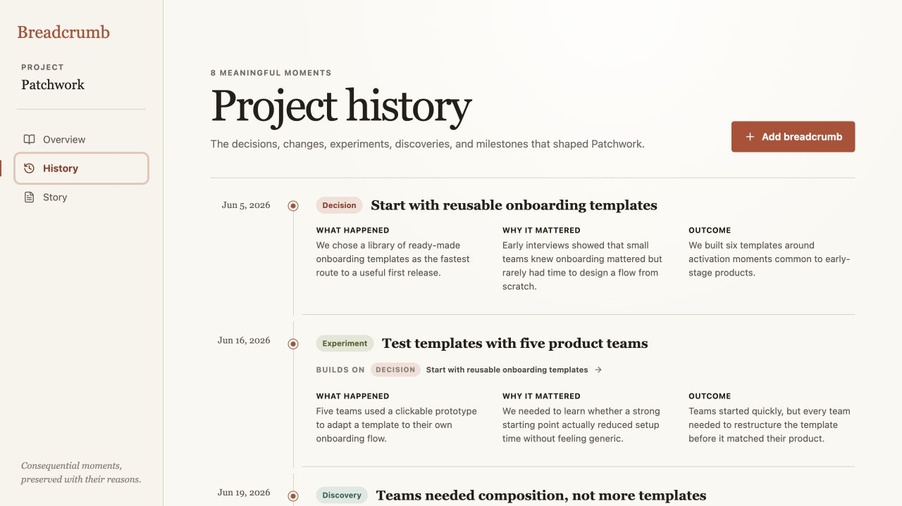
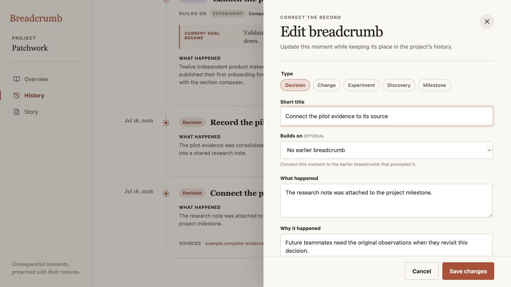
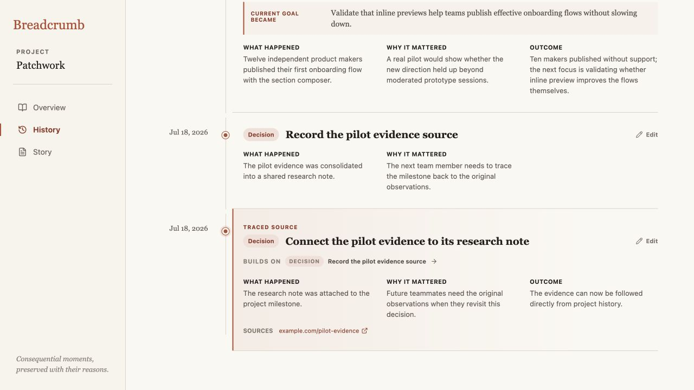

# Iteration 12 — Correct recorded project memory

## Audit scope

- Surface: Patchwork project History and the existing breadcrumb drawer.
- User goal: repair an inaccurate or incomplete recorded moment without breaking the story, causal trail, or current-goal source.
- Mode: combined UX and accessibility audit in the in-app browser at 1280 × 720.

## Flow evidence

### 1. Recorded history has no correction path — Needs attention

The timeline reads clearly, but every moment is final once saved. A typo, missing source, incorrect predecessor, or outdated explanation cannot be repaired from the product. This weakens trust in Breadcrumb as durable project memory.

### 2. Correction is available at the moment — Healthy

Each full-history entry now exposes a quiet, named **Edit** action. The action stays secondary to the narrative and does not appear in the compact Overview timeline. Every control has a 44 × 44 minimum target and an accessible name that includes the breadcrumb title.

### 3. The original record opens prefilled — Healthy

The established drawer pattern is reused with **Correct the record**, **Edit breadcrumb**, and **Save changes** language. Type, content, predecessor, goal transition, date, and source links are prefilled, so correction does not require recreating context. A current-goal source keeps its goal field required and explains why the value must remain traceable.

### 4. Saving repairs the same causal moment — Healthy

The corrected entry keeps its ID and place in history, gains the restored predecessor and outcome, and is marked **Traced source** after save. Focus returns to that timeline item, confirming the completed correction without moving the user to another view. Downstream citations and causal links continue to target the same record.

## Strengths

- Correction is local to the historical moment rather than becoming a separate management surface.
- Existing visual hierarchy, typography, drawer behavior, source validation, and sticky actions are preserved.
- Predecessor options exclude the edited breadcrumb, its descendants, and moments after the selected date, preventing new causal cycles.
- The latest chronological goal transition remains authoritative after an edit.

## Risks and evidence limits

- In-place correction intentionally does not preserve a visible revision log. That keeps V1 lightweight, but teams cannot yet inspect who changed a record or compare earlier wording.
- Native required-field behavior, named controls, focus return, and semantic dialog structure were checked. Full screen-reader behavior, focus trapping, zoom reflow, and mobile touch behavior still require dedicated assistive-technology and device testing.
- Browser-local persistence remains single-device and single-user; this audit does not claim collaborative conflict handling.

## Recommendation

Keep this in-place correction model for the prototype. The next audit should test whether the Story view makes newly corrected causal context obvious enough when someone resumes the project from the narrative rather than History.
