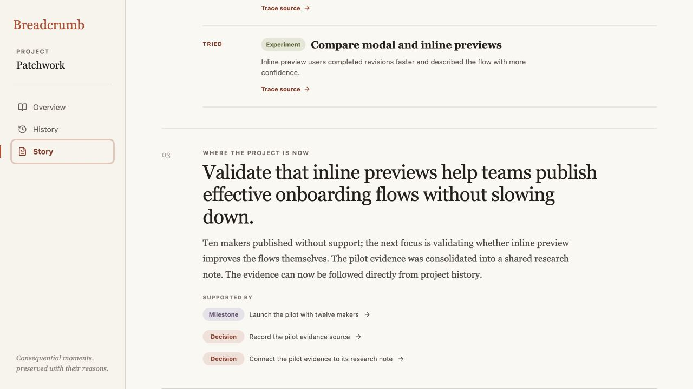
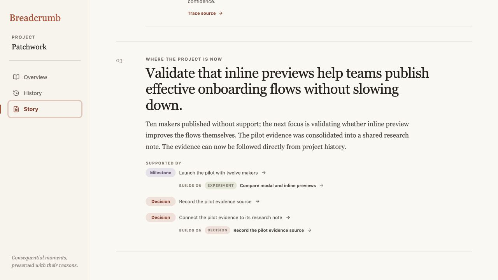
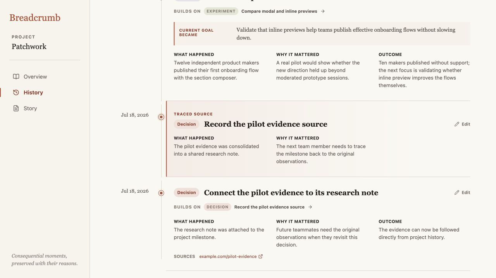

# Iteration 13 — Preserve causality in Story evidence

## Audit scope

- Surface: Patchwork **Story so far**, focused on the current-state evidence and its trace into History.
- User goal: resume from Story and understand not only which moments support the current state, but which recorded moment built on which.
- Mode: combined UX and accessibility audit in the in-app browser at 1280 × 720.

## Flow evidence

### 1. Supporting moments lose their relationship — Needs attention

The current state is traceable to three breadcrumbs, but **Supported by** presents them as peers. The corrected relationship from “Connect the pilot evidence to its research note” back to “Record the pilot evidence source” disappears, and the goal-setting milestone is visually disconnected from the preview experiment that prompted it.

### 2. Each citation keeps its recorded predecessor — Healthy

Story now keeps each source citation and adds its immediate **Builds on** relationship beneath it. This bridges the preview experiment into the pilot milestone and preserves the corrected evidence connection without implying a link between the two otherwise unrelated branches. The existing reading hierarchy and section structure remain unchanged.

### 3. The relationship traces to its source — Healthy

Following the Story relationship opens History, centers the earlier breadcrumb, moves keyboard focus to it, and marks it **Traced source**. The user can verify the relationship against the full “what happened” and “why it mattered” record instead of trusting an unsupported narrative cue.

## Strengths

- The change exposes recorded causality rather than generating new interpretation.
- Relationships reuse the same type labels, **Builds on** language, and History trace behavior already established elsewhere.
- Supporting sources remain independently traceable, while the predecessor action names its destination for assistive technology.
- Sources without a predecessor remain visually unchanged.

## Risks and evidence limits

- A dense current-state section can now show several secondary relationship lines. The present three-source example remains readable, but much larger source sets would need a separate density audit.
- Keyboard focus transfer and semantic button names were checked in the browser. Full screen-reader phrasing, zoom reflow, and mobile touch behavior still require dedicated assistive-technology and device testing.
- Story still distinguishes recorded causal links from chronological fallback through copy, but this audit does not test comprehension with unfamiliar participants.

## Recommendation

Keep immediate predecessor links inside Story evidence. The next improvement cycle should examine whether chronological fallback is labeled clearly enough that readers do not mistake recency for recorded causality.
