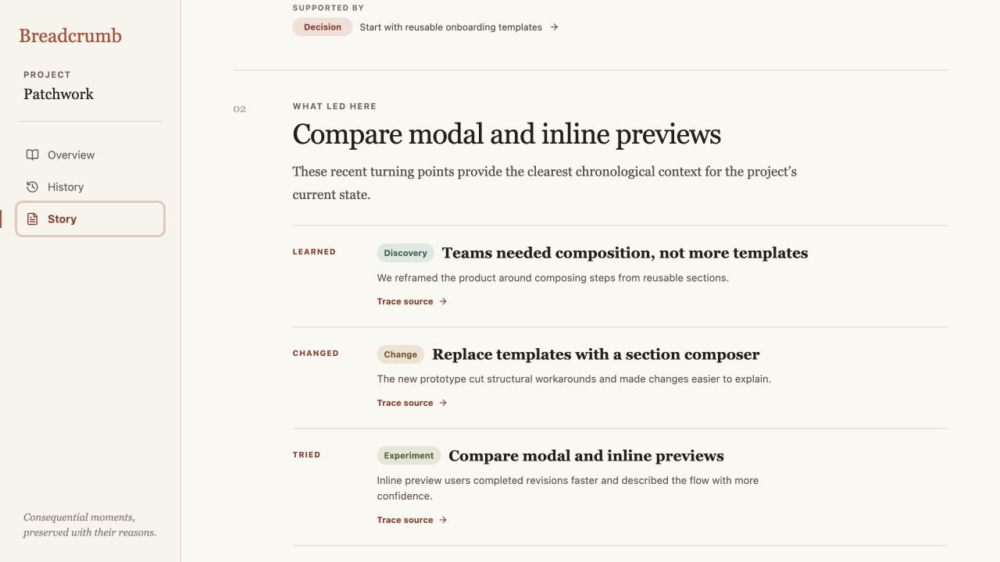
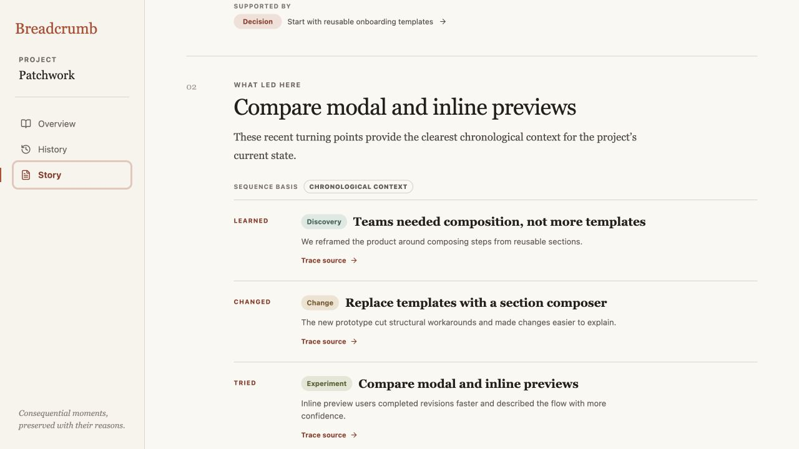
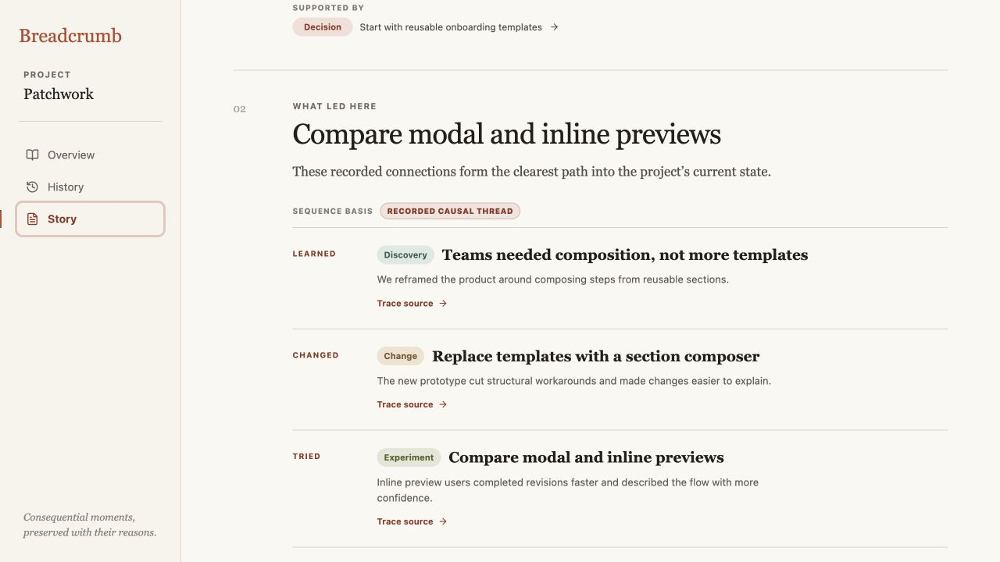

# Iteration 14 — Name Story sequence provenance

## Audit scope

- Surface: the middle **What led here** section of Patchwork’s Story.
- User goal: tell whether the displayed sequence follows relationships the team recorded or simply uses nearby moments as chronological context.
- Mode: combined UX and accessibility audit in the in-app browser at 1280 × 720.

## Flow evidence

### 1. The sequence basis is hidden in prose — Needs attention

The paragraph says the moments are chronological context, and the list has an assistive label, but the visible sequence itself begins immediately with **Learned → Changed → Tried**. A scanning reader can reasonably mistake this order for a causal claim.

### 2. Chronological fallback names itself — Healthy

A compact **Sequence basis — Chronological context** line now sits directly above the moments. It is visually quieter than the section title but precedes the relationship-style labels at the exact point where interpretation matters. The same visible text labels the list for assistive technology.

### 3. Recorded causality is visibly distinct — Healthy

After the missing predecessor is recorded through the existing edit flow, Story recomputes and visibly switches to **Recorded causal thread**. The warmer treatment distinguishes verified relationships from chronological fallback without changing the narrative layout or adding a graph.

## Strengths

- The label reports derivation provenance already known by the Story model; it does not add interpretation or stored data.
- Both visible and accessible names use the same exact language.
- The treatment changes automatically as project memory becomes more complete.
- Existing story beats, trace actions, typography, and reading order remain intact.

## Risks and evidence limits

- The label explains how the sequence was selected, not whether every sentence is complete or unbiased.
- Both provenance variants were checked in the browser, including the live switch after recording a predecessor. Full screen-reader phrasing, zoom reflow, and mobile touch behavior still require dedicated assistive-technology and device testing.
- This audit does not measure comprehension with unfamiliar participants; it verifies the distinction is explicit and positioned where the ambiguity occurs.

## Recommendation

Keep the visible sequence basis. The next cycle should audit empty and sparse histories, where a meaningful Story may not yet have enough evidence to form three complete sections.
