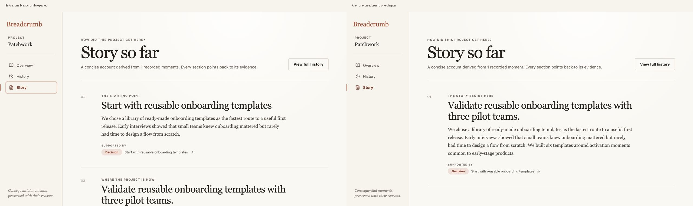
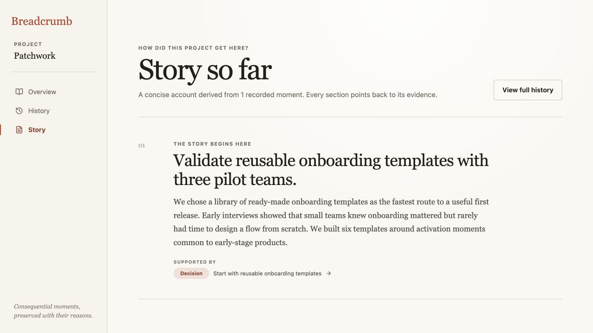
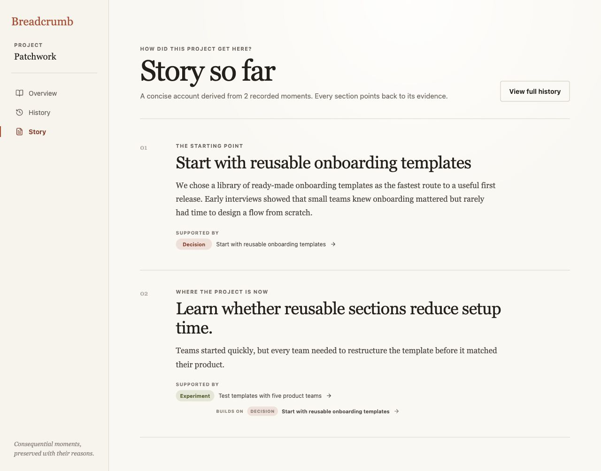

# Iteration 15 — Keep sparse Stories honest

## Audit scope

- Surface: Patchwork’s Overview summary and Story with one or two recorded breadcrumbs.
- User goal: understand how the project reached its current goal without seeing one piece of evidence repeated or inflated into a fuller history.
- Mode: combined UX and accessibility audit in the in-app browser at 1280 × 720, using isolated one- and two-breadcrumb fixtures.

## Flow evidence

### 1. One breadcrumb is presented as two chapters — Needs attention

The original Story used the same breadcrumb as both **The starting point** and **Where the project is now**. It repeated the outcome, cited the same source twice, and described a single recorded moment as though it were a path. The header also used the incorrect phrase **1 recorded moments**.

### 2. One breadcrumb now produces one grounded chapter — Healthy

The sparse Story now says **The story begins here**, names the current goal, combines the recorded what, why, and outcome once, and shows one supporting breadcrumb. The header uses **1 recorded moment**. On Overview, the browser DOM also confirmed **Derived from 1 breadcrumb** and the honest summary **One meaningful moment starts this project’s recorded story.**

### 3. A second breadcrumb adds exactly one distinct chapter — Healthy

With two recorded moments, Story grows to **The starting point** and **Where the project is now**. Each chapter has a distinct source; the second also exposes its recorded **Builds on** relationship. No middle sequence is invented before enough evidence exists to form one.

## Strengths

- The correction lives in Story derivation and count-aware copy; it adds no new stored state or product concept.
- Sparse histories now scale one meaningful moment at a time.
- Evidence buttons, causal trace links, typography, and reading order remain unchanged.
- The full eight-moment workspace still derives its existing three-section causal Story after the isolated fixtures are removed.

## Risks and evidence limits

- The empty-history state remains unaudited; Story currently has no dedicated explanation when no breadcrumbs exist.
- This audit verifies browser-visible structure, source uniqueness, and copy. Full screen-reader phrasing, zoom reflow, and mobile touch behavior still require dedicated assistive-technology and device testing.
- The fixtures use existing Patchwork records and do not measure comprehension with unfamiliar participants.

## Recommendation

Keep the sparse Story rule. The next cycle should audit an empty project history and give Overview, History, and Story a coherent first-breadcrumb path without introducing generic project-management scaffolding.
