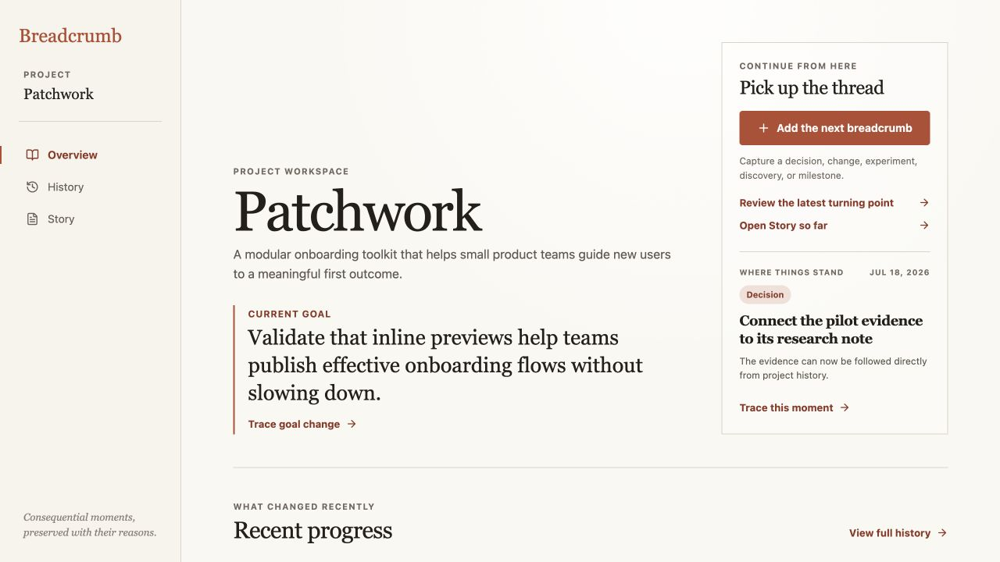
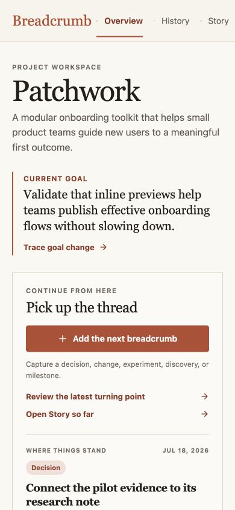

# Iteration 16 — Orient a returning teammate from Project Home

## Audit scope

- Surface: Patchwork Overview, now used as the Project Home for a returning team member.
- User goal: understand the current focus, see what changed, find unresolved context, and choose a grounded next action without entering a task dashboard.
- Mode: combined UX and accessibility audit in the in-app browser at the default desktop viewport, with a 390 × 844 mobile breakpoint check.

## Flow evidence

### 1. Current state is visible before the history — Healthy

The Home opens with the project description and a prominent **Current goal** block. The goal source remains traceable through **Trace goal change**, so the focus is explained by project memory rather than presented as a detached status field.

### 2. Recent progress is a short orientation layer — Healthy

**Recent progress** now presents the three latest meaningful breadcrumbs as compact, outcome-led rows. Each row includes its type, date, consequence, and a **Review** action; the full chronological Timeline remains available through **View full history**.

### 3. Open context is derived, not managed as tasks — Healthy

The **Open threads** section derives its first thread from the current goal and adds recorded moments whose outcome is still missing. Each thread identifies the source breadcrumb and offers either **Review the source** or **Record the outcome**. The seeded workspace therefore makes unfinished context visible without introducing assignees, statuses, or a separate task entity.

### 4. The next action is contextual — Healthy

The **Continue from here** panel keeps three useful actions together: add the next breadcrumb, review the latest turning point, and open Story so far. The panel also shows the latest recorded moment and lets the user trace it into History. Browser verification confirmed that the open-thread outcome action opens the existing edit drawer and that the latest-turning-point action opens History with the source highlighted.

### 5. Mobile orientation remains readable — Healthy

At 390 × 844, the sidebar becomes the existing compact navigation, the current goal retains its reading hierarchy, and the continuation panel expands to the available width. The primary capture action remains visible without horizontal overflow.

## Strengths

- Home derives every new surface from `Project` and `Breadcrumb` records; no task, metric, or dashboard entity was added.
- Recent progress is deliberately shallower than History, preserving the timeline and Story as deeper evidence views.
- Open threads remain honest: the current goal is an open focus, while missing outcomes are explicitly labelled as missing rather than inferred.
- Continuation actions preserve the existing capture, trace, edit, and Story routes, so the new orientation layer connects to working product behavior.

## Risks and evidence limits

- Open-thread derivation currently treats the current goal as the canonical open focus; richer unresolved questions would require explicit future breadcrumb semantics rather than text guessing.
- This audit verifies browser-visible structure, action routing, and breakpoint layout. Full screen-reader phrasing, zoom reflow, and device touch behavior still need dedicated assistive-technology testing.
- Full-page screenshot stitching is unreliable with the fixed sidebar in the browser harness; visual review used normal viewport captures instead.

## Recommendation

Keep Project Home as the orientation layer and let the next cycle audit the first-breadcrumb / empty-history path, ensuring a new project can reach the same useful loop without synthetic progress.
