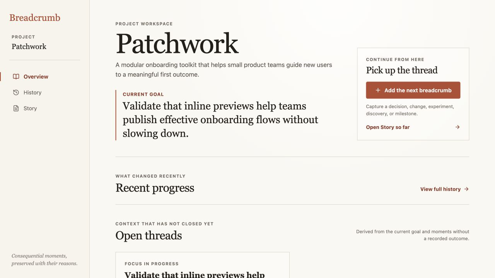
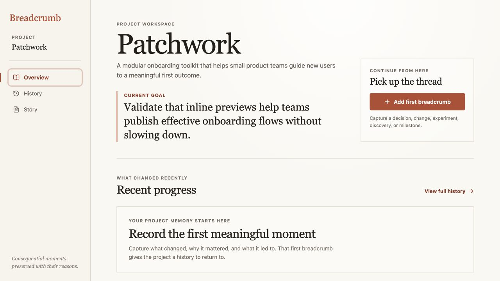
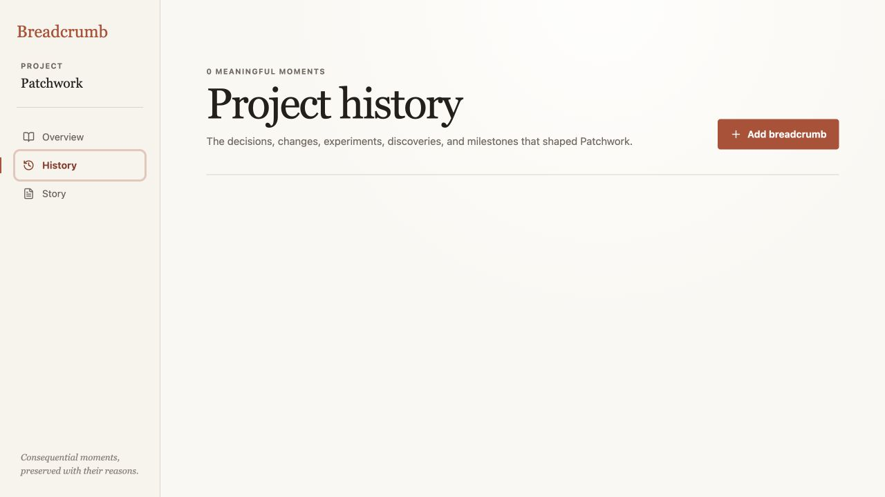
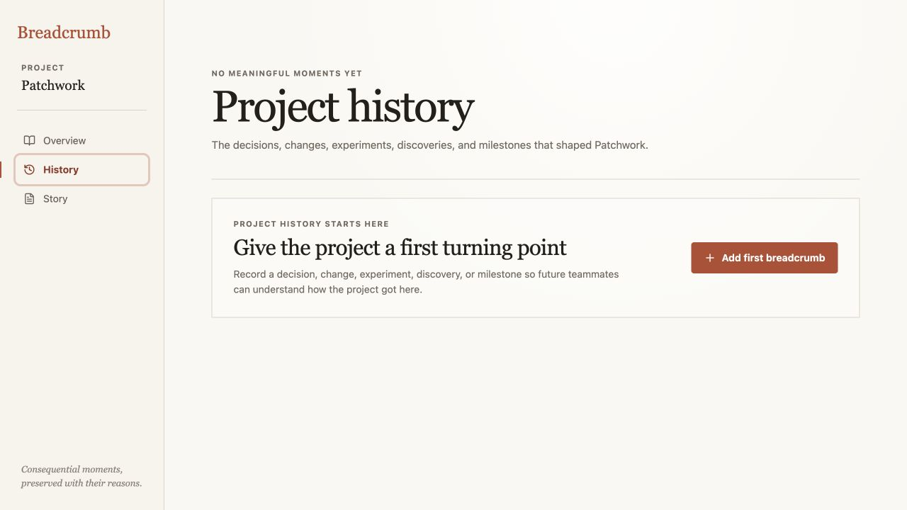
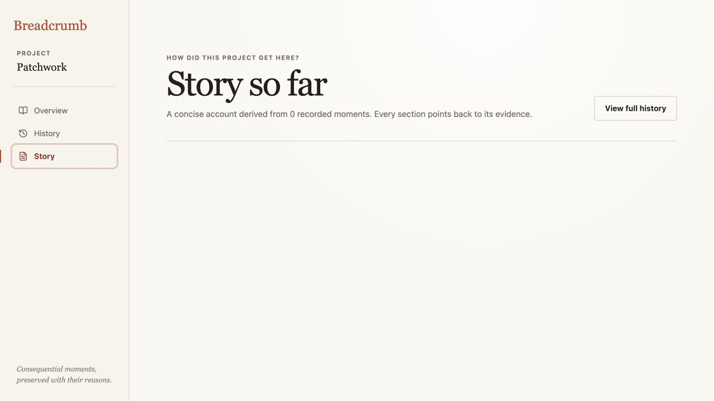

# Iteration 17 — Give an empty project a first breadcrumb

## Audit scope

- Surface: Patchwork Overview, History, and Story with zero recorded breadcrumbs.
- User goal: understand what the project needs from a new or newly opened workspace, then reach the first meaningful capture without hitting a blank screen.
- Mode: combined UX and accessibility audit in the in-app browser at 1280 × 720, using an isolated empty workspace fixture. The normal browser-local workspace was restored and rechecked after capture.

## Flow evidence

### 1. Overview before — Needs attention

The current goal was visible, but Recent progress was an empty list, Open threads treated an unrecorded goal as a thread, and the Story preview said **Follow the recorded path from “undefined” to “undefined.”** The only clear action was the generic capture button in the side panel.

### 2. Overview after — Healthy

Overview now names the first step directly: **Record the first meaningful moment**. The explanation preserves Breadcrumb’s what / why / outcome distinction, and the top continuation panel changes to **Add first breadcrumb**. The Story preview now says the story will take shape after the first meaningful moment instead of inventing endpoints. Open threads are omitted until there is recorded context to resolve, so the screen keeps one primary first-step action.

### 3. History before — Needs attention

History showed a count, heading, description, and an empty list with no explanation of what belonged there or how to begin.

### 4. History after — Healthy

The count becomes **No meaningful moments yet**, and the empty panel explains that the first record should be a project turning point with one **Add first breadcrumb** action. The primary path is still the existing capture drawer; no new entity or route was added.

### 5. Story before — Needs attention

Story presented a header describing **0 recorded moments** and then stopped at a blank canvas. It offered only a detour to History, which also contained no guidance.

### 6. Story after — Healthy

Story now explains why evidence is required and offers **Add first breadcrumb** in the same reading-oriented panel used by the other empty states. It does not fabricate a chapter, source, or narrative claim without a breadcrumb.

### 7. First capture loop — Healthy

From the empty Story state, **Add first breadcrumb** opened the existing capture drawer with the expected type, what happened, why, outcome, goal, date, and source-link fields. An isolated realistic breadcrumb was saved successfully; Story immediately became one honest, source-backed section titled **The story begins here**. The normal browser-local workspace was then restored and confirmed to still contain its existing history.

## Strengths

- All three views use one shared empty-memory component and the existing capture loop.
- Empty states explain the product’s central unit—meaningful moments—instead of using generic “nothing here” language.
- The first Story remains traceable: one saved breadcrumb produces one section and one supporting citation.
- The normal seeded/local workspace remains unchanged after the isolated audit fixture is removed.

## Risks and evidence limits

- The isolated fixture uses the existing Patchwork project goal; an entirely new project-creation flow remains out of scope for this iteration.
- The empty states intentionally keep one primary capture action per view: Overview uses its continuation panel, while History and Story use the local empty-memory panel.
- This audit verifies browser-visible structure, focusable controls, and the capture transition. Full screen-reader phrasing, zoom reflow, and device touch behavior still need dedicated assistive-technology testing.

## Recommendation

Keep the first-breadcrumb pattern as the canonical empty state. The next cycle should examine how a saved first moment changes Project Home and whether the current-goal requirement in capture is explained clearly enough for a genuinely new project.
