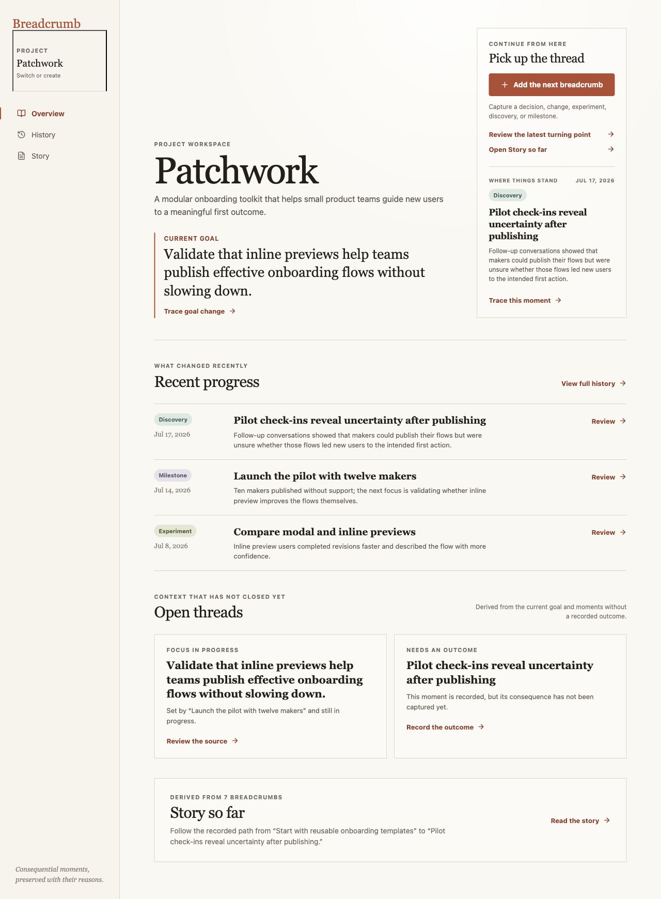
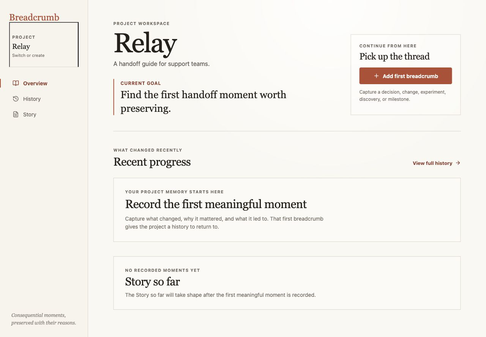
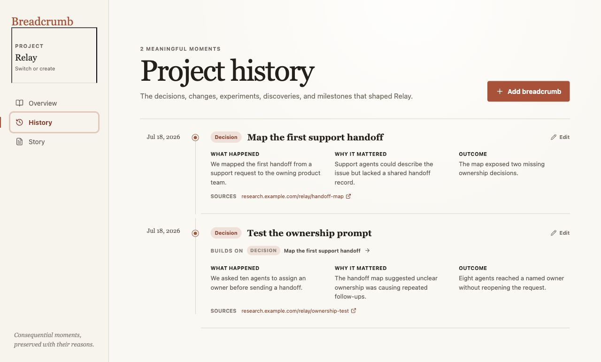
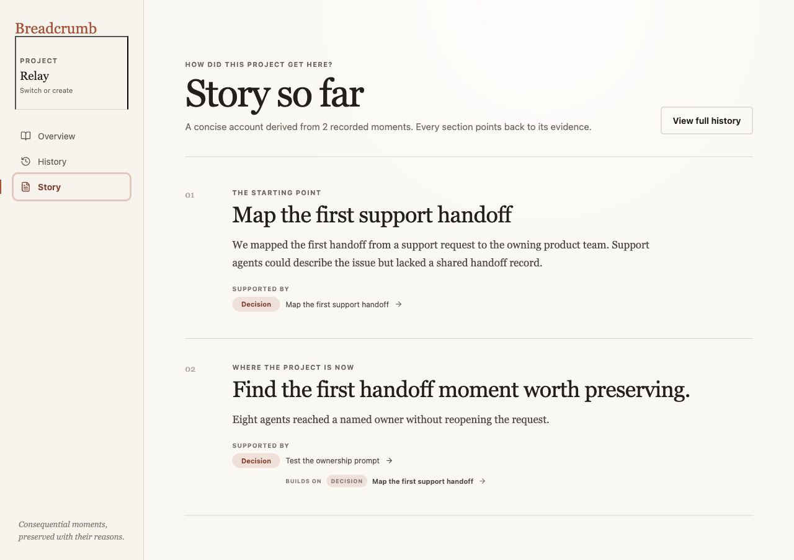
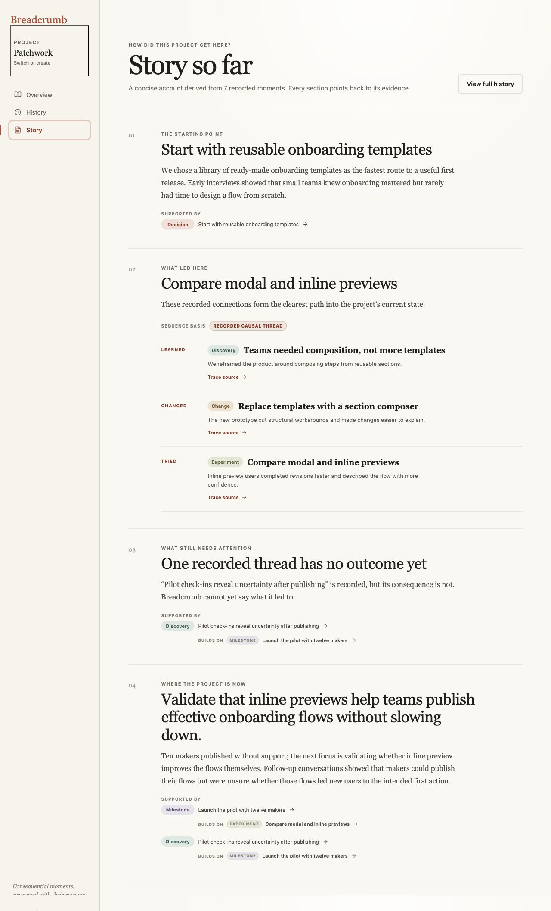

# Iteration 19–20 — Multiple project memories and evidence-backed Story

## Audit scope

- Flow: create or open a local project → empty memory → first breadcrumb → linked breadcrumbs → History → Story → return to a richer seeded project.
- User goal: understand what happened, why it happened, what supports that reading, and what still lacks a conclusion.
- Mode: in-app browser using local persistence, with realistic seeded Patchwork history and a created Relay project.

## Flow evidence

### 1. Returning to a project — Healthy

Patchwork orients a returning teammate with a current goal, recent evidence, the most recent unresolved finding, and two open threads. The origin of the goal remains traceable.

### 2. Creating an empty project — Healthy

The project switcher creates Relay without inheriting Patchwork history. The empty state describes exactly what is missing and points to the first breadcrumb without fabricating an open thread.

### 3. Several linked breadcrumbs in History — Healthy

History records source, date, what happened, why it mattered, and outcome for every moment. The second Relay breadcrumb visibly links back to the first and preserves its supporting source.

### 4. Partial Story after two moments — Healthy

The early Story stays compact: an origin and a current state, each supported by a breadcrumb. It does not invent a turning point before enough evidence exists.

### 5. Seven-moment Story with an unresolved thread — Healthy

Patchwork’s Story groups a recorded causal thread, labels that grouping as a recorded causal sequence, preserves source-level trace actions, and explicitly says that the latest discovery has no recorded consequence.

## Strengths

- Projects remain locally separate; switching changes the active context without mixing breadcrumbs.
- Story claims only use breadcrumb fields and each section retains source buttons.
- Related breadcrumbs are grouped only when their recorded `buildsOn` links support the sequence.
- Incomplete outcomes become an explicit Story section instead of a conclusion.

## Limits and follow-up

- This audit checked visible layout and interaction. Keyboard-only focus restoration, screen-reader announcements, and source-link destinations need separate assistive and integration testing.
- Current local project creation is intentionally device-local; joining a remote shared project remains out of scope until collaboration is introduced.
- The existing deterministic Story labels chronology as “Chronological context” whenever no causal links support a stronger claim.

## Recommendation

Next, audit keyboard movement through project switching and source tracing, then consider whether imported or manually corrected evidence needs a visible confidence or conflict marker.
