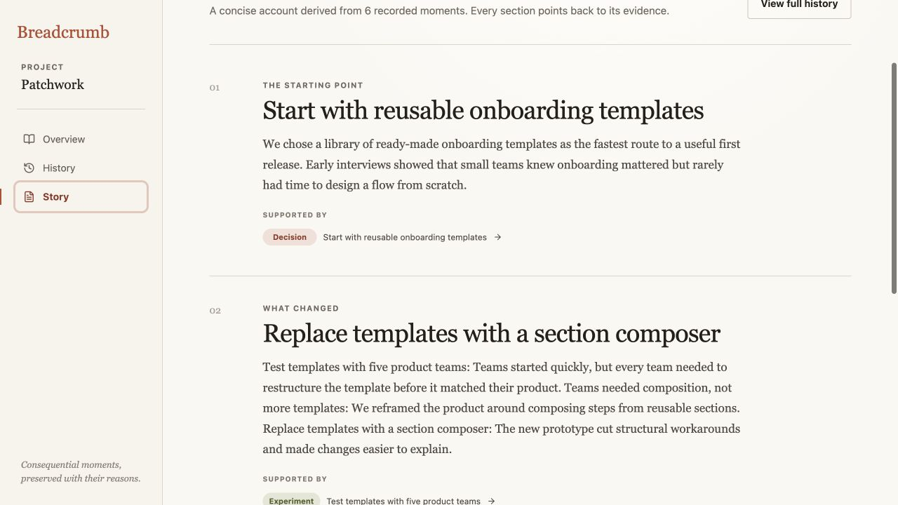
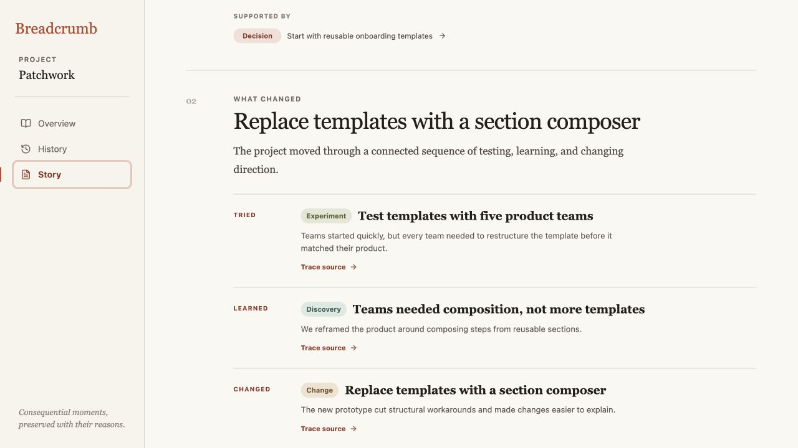

# Breadcrumb product audit — iteration 2

## Scope

Focused UX and visible accessibility review of the “What changed” section in Story so far at a 1280 × 720 desktop viewport.

## User goal

Understand not only which turning points occurred, but how an experiment changed the team’s understanding and led to a different product direction.

## Steps

### 1. Existing synthesis — traceable but mechanically assembled

The section names the correct experiment, discovery, and change, and exposes their sources. However, the body concatenates titles and outcomes into one dense paragraph. The user must infer which moment was tried, what was learned, and what changed as a result.

### 2. Causal sequence — healthy and distinct

The same evidence now reads as an explicit **Tried → Learned → Changed** sequence. Each beat has a short outcome and its own source action, so the narrative explains causality without inventing a relationship graph or adding new persistent data.

## Visible accessibility notes

- The sequence is an ordered list with a clear accessible label and heading hierarchy.
- Each source action has a source-specific accessible name even though the concise visible label remains “Trace source.”
- Screenshot evidence cannot prove complete keyboard order, screen-reader phrasing, zoom behavior, or WCAG conformance.

## Iteration outcome

The story now makes a key product distinction visible: Breadcrumb does not merely list what happened; it shows how testing produced learning and how that learning changed the work.
