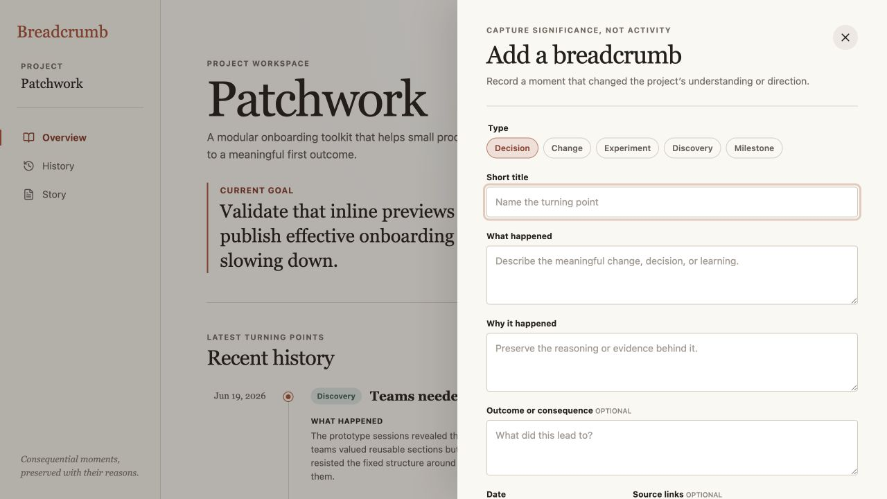
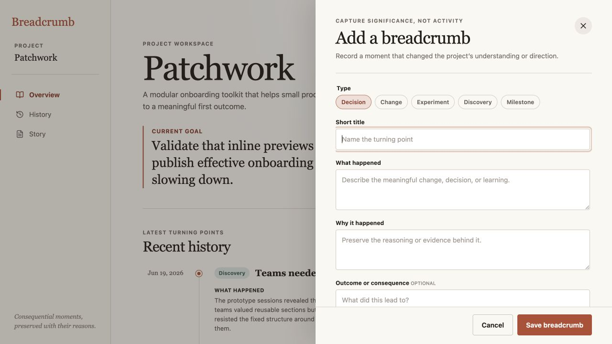

# Breadcrumb product audit — iteration 3

## Scope

Focused UX and visible accessibility review of breadcrumb capture at a 1280 × 720 desktop viewport.

## User goal

Record a consequential project moment with enough context to preserve what happened, why it mattered, and what resulted—without losing sight of how to finish.

## Steps

### 1. Existing drawer — complete form, unclear completion

The form keeps the important context fields visible and reinforces that Breadcrumb is not an activity log. At this viewport, however, both completion actions sit below the fold. A user cannot see the extent of the form and its final commitment point at the same time.

### 2. Fixed completion zone — healthy

The context fields now scroll independently while Cancel and Save breadcrumb stay visible. This preserves the depth of capture, makes the completion action predictable, and avoids compressing “why” into a token field simply to fit one screen.

## Visible accessibility notes

- The dialog, field labels, required inputs, and button names remain present in the inspected DOM.
- Keeping actions visible improves discoverability at shorter viewports and when content is enlarged.
- The live flow confirmed type selection, required-field entry, saving, history updates, latest-context updates, and persistence after reload.
- Screenshot and DOM evidence do not prove a complete keyboard focus trap, screen-reader phrasing, or WCAG conformance.

## Iteration outcome

Capture remains intentionally thoughtful, but it no longer hides the action that completes the project-memory loop.
