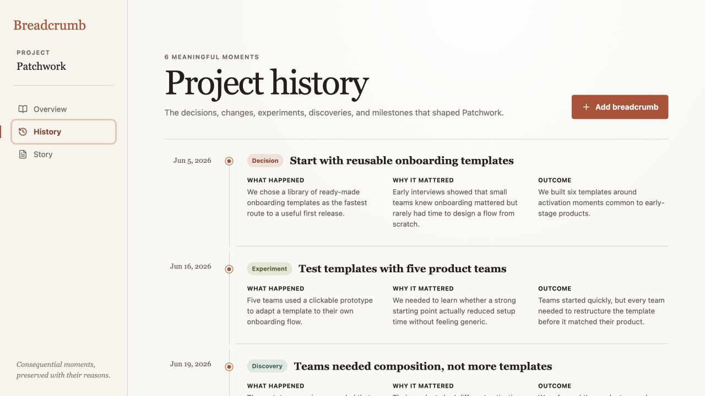
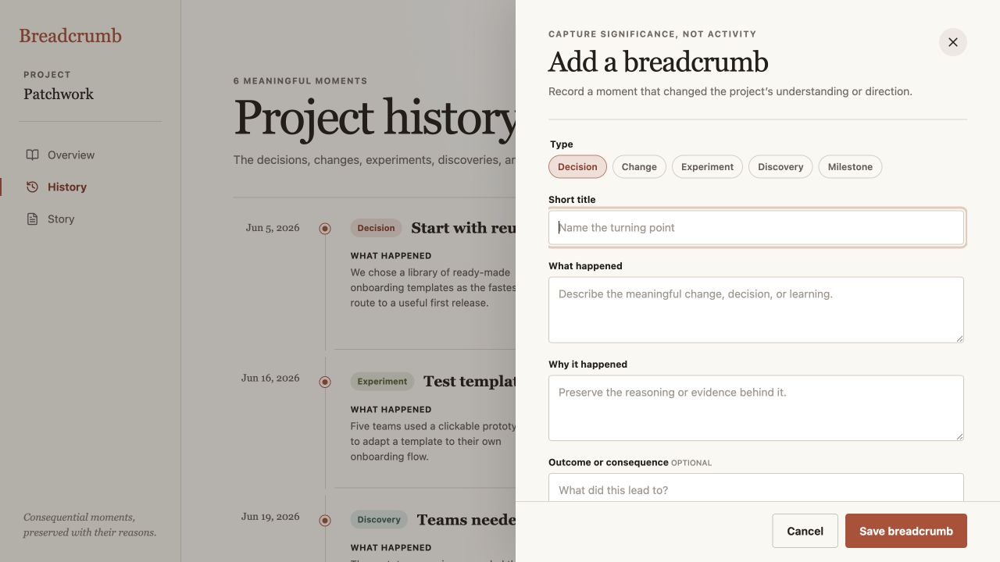
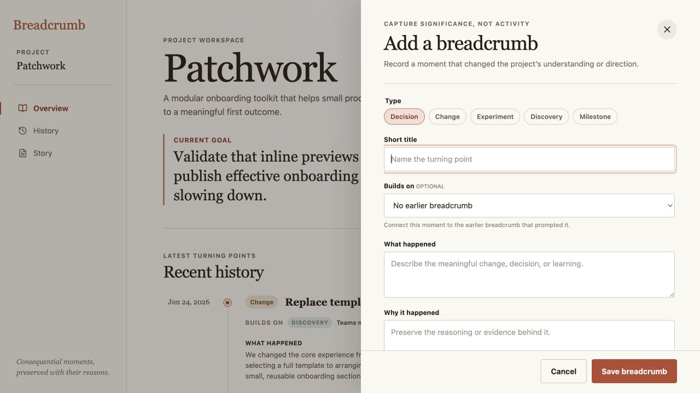
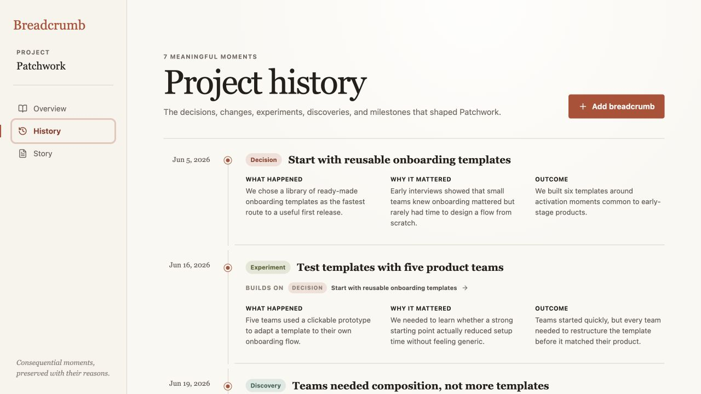

# Breadcrumb product audit — iteration 4

## Scope

Focused UX and visible accessibility review of causal continuity across History and breadcrumb capture at a 1280 × 720 desktop viewport.

## User goal

Understand which earlier project moment prompted a consequential decision, experiment, learning, change, or milestone—and preserve that connection when recording a new breadcrumb.

## Steps

### 1. Existing history — chronological but inferential

The timeline preserves a readable sequence and gives each moment its reasoning and outcome. It does not state whether the experiment followed from the initial decision or merely happened afterward, so the user must infer causal continuity from adjacent prose.

### 2. Existing capture — no place to preserve continuity

Capture collects the meaningful context of a new moment but cannot name the earlier breadcrumb that prompted it. Any causal connection discussed at capture time is lost or must be repeated indirectly in the prose.

### 3. Optional predecessor — healthy and lightweight

The optional **Builds on** selector uses the existing breadcrumb vocabulary, defaults to no connection, and explains its purpose in one line. It adds one focused decision to capture without creating a relationship editor or blocking the existing save path.

### 4. One-hop trace — healthy and legible

Connected entries now expose a quiet **Builds on** line with the predecessor’s type and title. The line is an action that returns to the earlier breadcrumb, so chronology remains primary while causal continuity becomes explicit and traceable.

## Visible accessibility notes

- The new field is a native labelled select with an explicit optional state and a no-connection default.
- Each timeline connection is a button with a source-specific accessible name.
- The live flow confirmed selection, saving, timeline display, trace navigation, Story integrity, and persistence after reload.
- Screenshot and DOM evidence do not prove complete keyboard order, screen-reader phrasing, zoom behavior, or WCAG conformance.

## Iteration outcome

Breadcrumb now preserves one explicit causal step between meaningful moments while retaining its chronological reading model and avoiding the out-of-scope complexity of a dependency graph.
