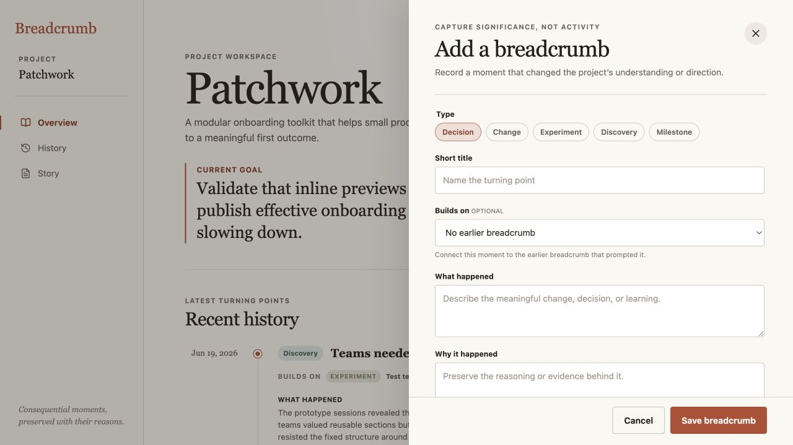

# Breadcrumb product audit — iteration 5

## Scope

Focused visible accessibility review of keyboard focus in the breadcrumb type selector at a 1280 × 720 desktop viewport.

## User goal and accessibility target

Choose the kind of consequential project moment being recorded while always knowing which control currently has keyboard focus.

## Steps

### 1. Focus reaches the radio group but disappears visually — needs attention

The selector uses a correctly named native radio group, and the focused input is present in the inspected DOM. Because that input is visually hidden, the global focus outline is also hidden. The selected Decision pill looks identical whether it has keyboard focus or not, leaving keyboard users without a visible location cue.

### 2. Focus is transferred to the visible pill — healthy

The focused pill now receives the same restrained accent outline used elsewhere in the product. Selection fill and focus outline remain distinct, the layout does not shift, and the treatment fits the existing capture design rather than adding a new interaction pattern.

## Accessibility notes

- The native fieldset, legend, radio names, checked state, and keyboard focus target remain intact.
- The change affects only `:focus-visible`, so it does not add permanent decorative emphasis to every type pill.
- The live flow confirmed type selection, completing the form, saving, the Overview update, and persistence after reload.
- The inspected browser surface did not provide conclusive evidence for every platform’s radio-group arrow-key behavior, focus trapping, screen-reader announcement, zoom behavior, or WCAG conformance.

## Iteration outcome

The first choice in breadcrumb capture now exposes a visible keyboard position without changing the capture model or adding friction to the project-memory workflow.
