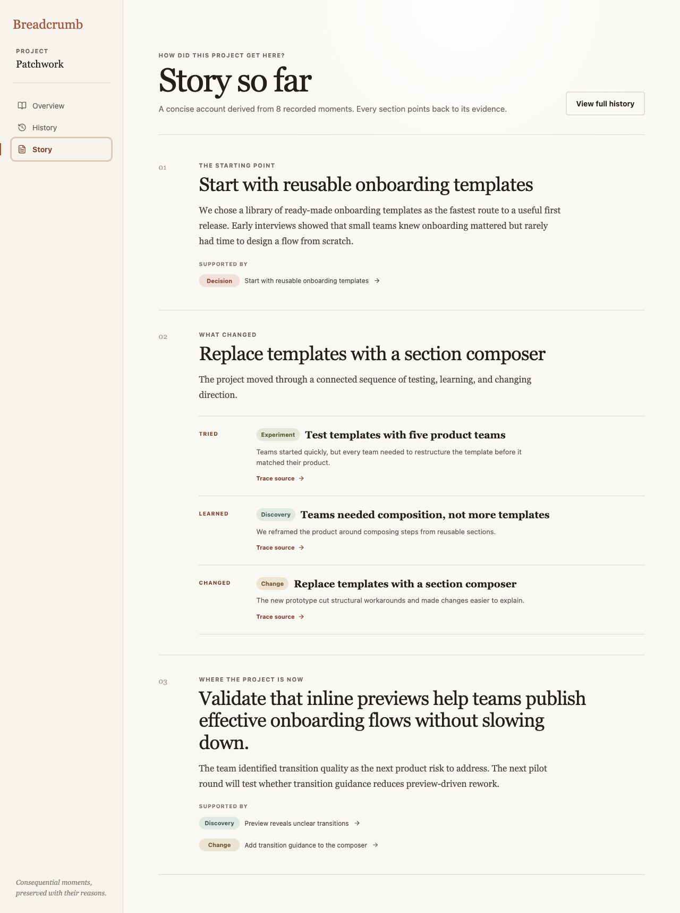
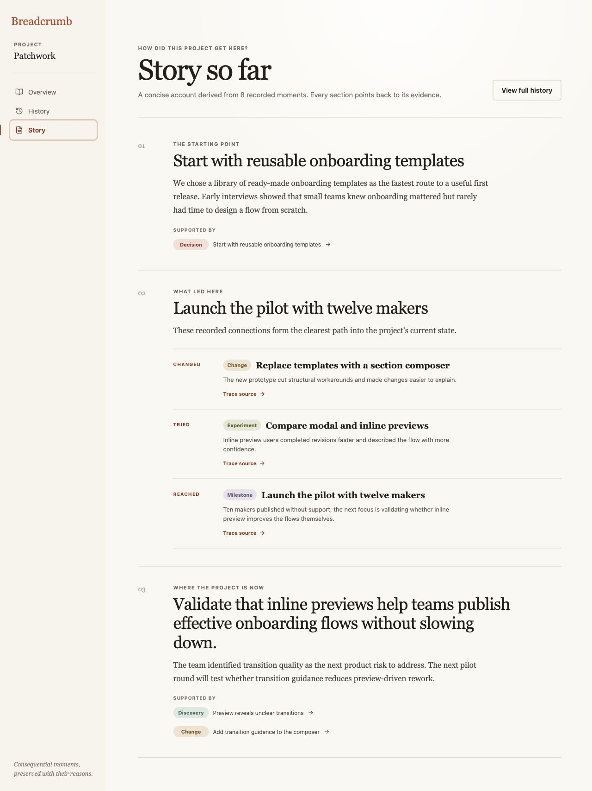

# Breadcrumb product audit — iteration 6

## Scope

Focused UX and visible accessibility review of Story so far after extending the seeded project from six to eight explicitly connected breadcrumbs.

## User goal and accessibility target

Return to a growing project and understand the recorded path into its current state, with every narrative step remaining identifiable and traceable to History.

## Steps

### 1. Longer history exposes a stale middle — needs attention

The origin and current-state sections correctly reflect the first and newest moments. The middle section still selects the earliest experiment, discovery, and change by position, so it stops at the section composer while the current state begins two causal steps later. The user must infer how the inline-preview experiment and pilot milestone connect those sections.

### 2. Story follows the nearest recorded path — healthy

The middle now walks the explicit predecessor chain nearest the current state: the composer change led to the preview experiment, which reached the pilot milestone. The labels expand naturally to **Changed → Tried → Reached**, the section heading advances with the project, and each step retains its source action.

## Accessibility notes

- The sequence remains an ordered list with a truthful accessible label: **Recorded causal thread**.
- Every visible trace action keeps a source-specific accessible name and successfully navigates to the matching History entry.
- Older browser-local workspaces without predecessor links receive recent chronological context labelled **Recent project sequence**, rather than an unsupported causal claim.
- Screenshot and DOM evidence do not establish complete screen-reader phrasing, focus order after animated scrolling, zoom behavior, or WCAG conformance.

## Iteration outcome

Story now evolves with the recorded project path instead of freezing its explanation around the first three typed turning points.
