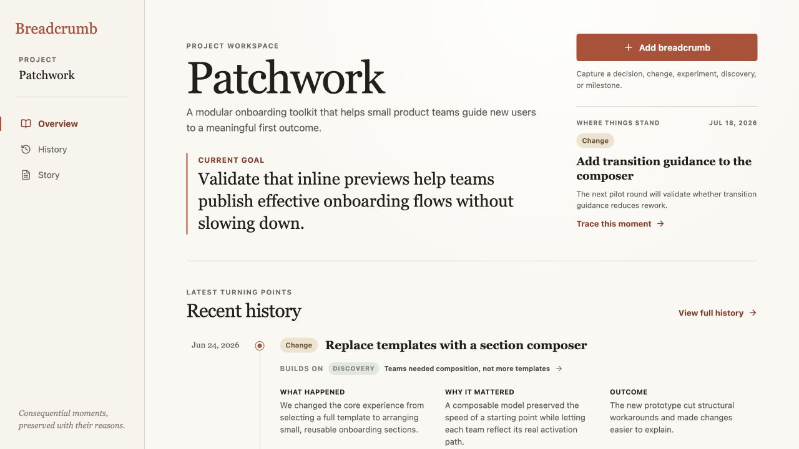
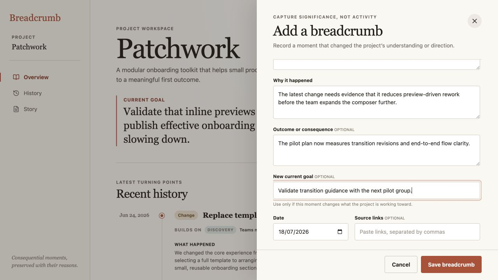
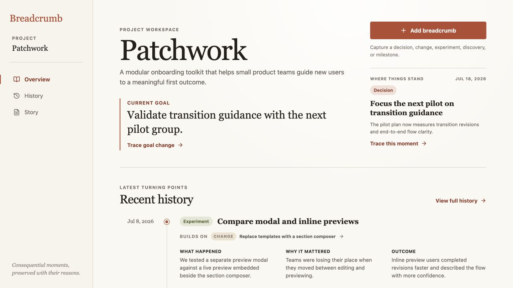

# Breadcrumb product audit — iteration 7

## Scope

Focused UX and visible accessibility review of how a meaningful project change affects the Current goal on Overview.

## User goal and accessibility target

Record a turning point that changes what the team is working toward, then return later and understand both the new goal and the reason it changed.

## Steps

### 1. History advances while the goal stays behind — needs attention

The newest recorded change says the next pilot will validate transition guidance, while the prominent Current goal still focuses broadly on inline previews. Both statements are individually readable, but their disagreement weakens orientation and leaves no action for reconciling the project snapshot with its history.

### 2. Goal change stays inside meaningful capture — healthy

The optional **New current goal** field sits beside the outcome and source fields, where a user already explains the consequences of a moment. It shows the existing goal as context and explicitly says to use it only when the work’s focus changes, avoiding a detached settings edit or a second goal-history model.

### 3. Current goal and its reason remain together — healthy

Saving the decision updates Current goal, promotes the same decision into “Where things stand,” and adds **Trace goal change** directly beneath the goal. The action successfully opens the supporting breadcrumb in History, so the project’s present direction remains accountable to recorded reasoning.

## Accessibility notes

- The new field is a labelled native text input with separate explanatory text and an optional state.
- The save result is announced through the existing polite live region as “Breadcrumb added and current goal updated.”
- **Trace goal change** has a clear visible name, keyboard focus treatment, and a deterministic History destination.
- Screenshot and DOM evidence do not establish complete screen-reader phrasing, focus restoration after the drawer closes, zoom behavior, or WCAG conformance.

## Iteration outcome

Breadcrumb can now advance the project’s current direction through the same consequential moment that explains why it changed.
