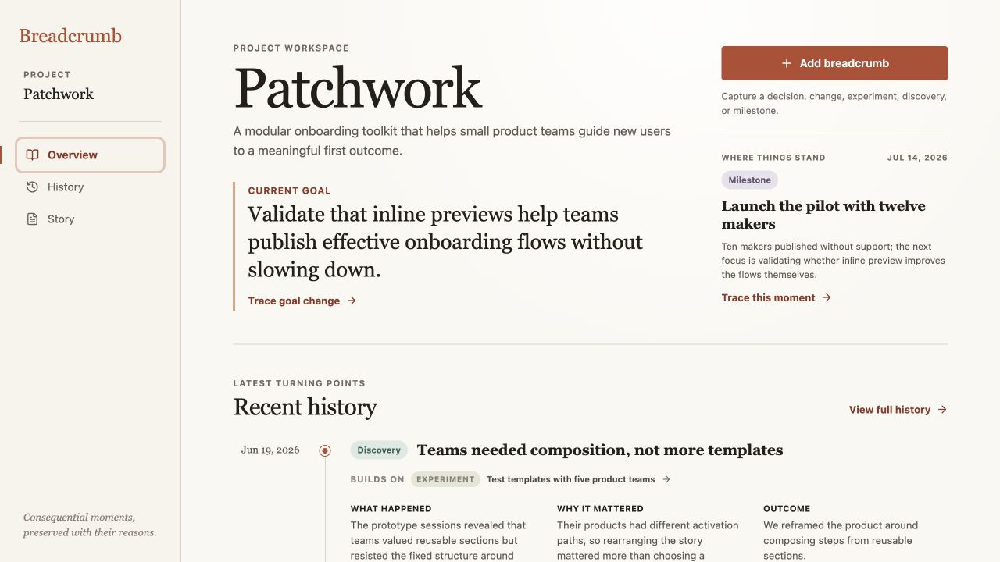
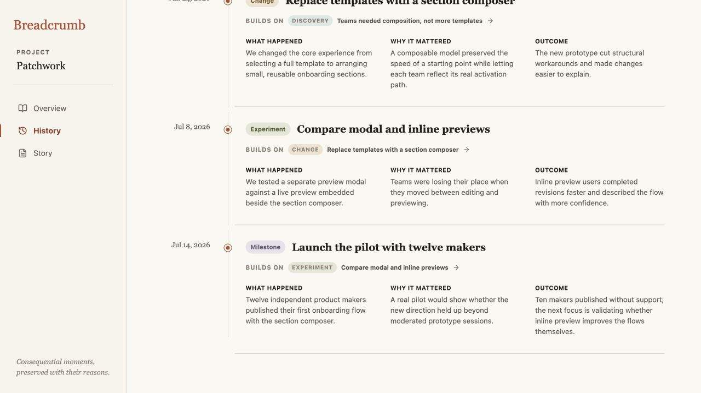
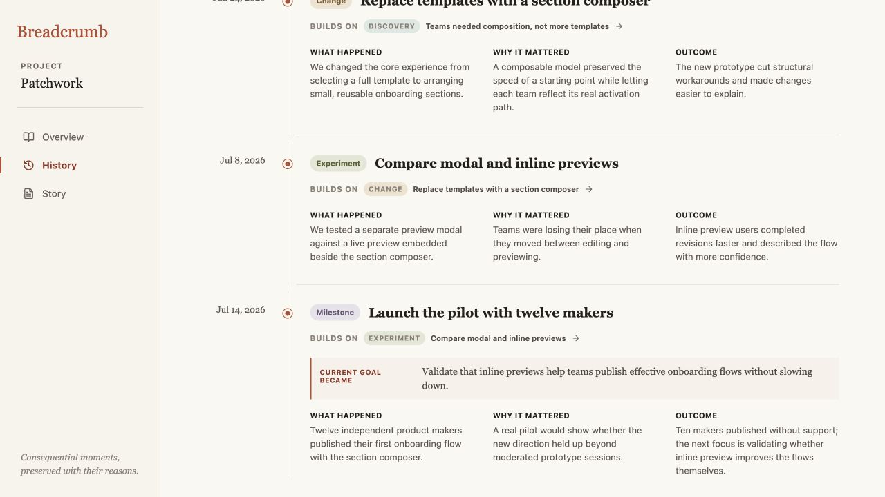

# Breadcrumb product audit — iteration 8

## Scope

Focused UX and visible accessibility review of tracing the Current goal from Overview to the breadcrumb that set it in History.

## User goal and accessibility target

Understand not only the project’s current direction, but the exact recorded moment in which that direction became the goal.

## Steps

### 1. The current goal exposes its source — healthy

**Trace goal change** sits directly beneath the goal and uses the same restrained trace language as the rest of the workspace. The destination is discoverable without turning the goal into a settings surface.

### 2. The source initially looked like an ordinary moment — needs attention

The trace opened and scrolled to the correct milestone, but the entry described only what happened, why it mattered, and the outcome. Nothing at the destination confirmed that this milestone set the goal shown on Overview, making the trace technically correct but semantically incomplete.

### 3. The goal transition is explicit at the source — healthy

The source entry now names **Current goal became** and shows the resulting goal before the supporting details. The treatment is visually subordinate to the breadcrumb title, consistent with the project’s existing warm accent, and specific enough to explain why the user landed here.

## Accessibility notes

- The goal transition uses an ordered heading and paragraph, so its label and value remain available without relying on color or the left rule.
- No additional interaction or focus stop was introduced.
- The existing trace action remains keyboard reachable and its destination remains deterministic.
- Screenshot and DOM evidence do not establish complete screen-reader phrasing, zoom behavior, or WCAG conformance.

## Iteration outcome

Tracing the current goal now ends with a self-explanatory piece of project memory instead of an otherwise ordinary History entry.
