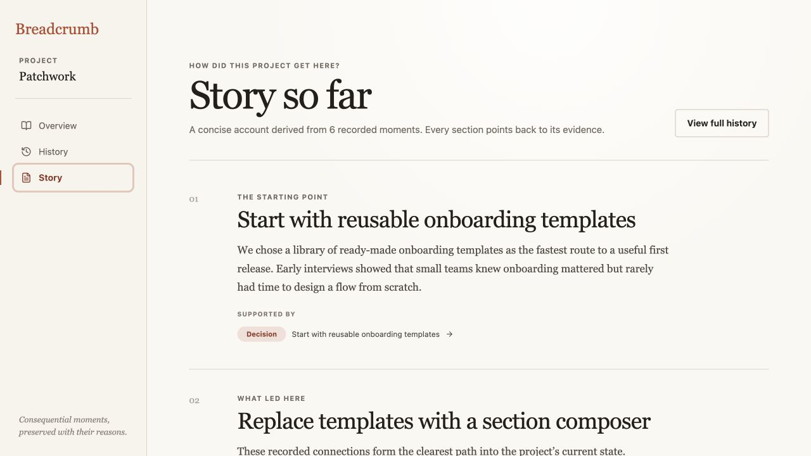
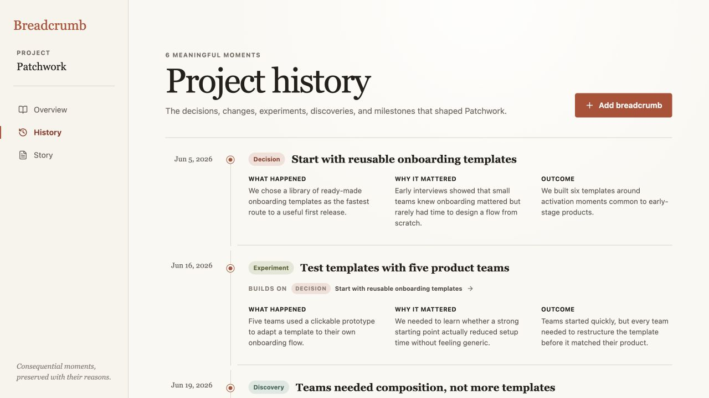
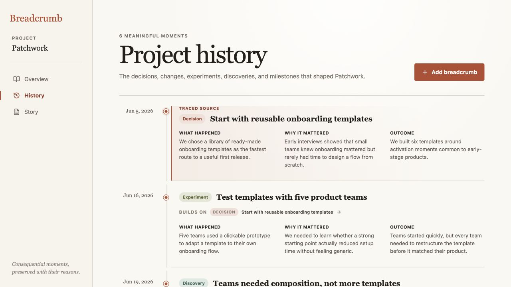

# Breadcrumb product audit — iteration 9

## Scope

Focused UX and accessibility review of tracing evidence from Story into the exact supporting breadcrumb in History.

## User goal and accessibility target

Follow a derived explanation back to its evidence and immediately know which timeline moment is the destination, including when navigating by keyboard or with reduced motion enabled.

## Steps

### 1. Story exposes its evidence — healthy

The opening section names its supporting decision directly beneath the explanation. The citation is compact, specific, and visually subordinate to the narrative it supports.

### 2. The destination initially blended into History — needs attention

The citation switched views and reached the correct first breadcrumb, but that entry looked identical to every other moment. At the top of the timeline the scroll position also changed very little, leaving no strong confirmation that the trace had completed.

### 3. The traced source is unmistakable — healthy

The destination now carries a temporary **Traced source** label, warm edge, soft background, and emphasized timeline marker. The treatment preserves the existing reading hierarchy while making the cross-view arrival explicit.

## Accessibility notes

- The target receives programmatic focus and `aria-current="true"`, giving assistive technology a state change alongside the visual treatment.
- The visible **Traced source** label means the state does not rely on color alone.
- Direct History navigation and reload clear the temporary state, preventing stale selection from masquerading as project data.
- Programmatic scrolling follows the user’s reduced-motion preference.
- Screenshot and DOM evidence do not establish complete screen-reader announcement behavior, zoom resilience, or WCAG conformance.

## Iteration outcome

Breadcrumb’s cross-view traces now complete with a visible, focused destination instead of relying on scroll position alone.
