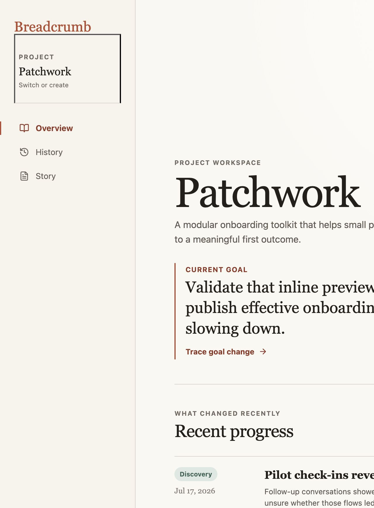
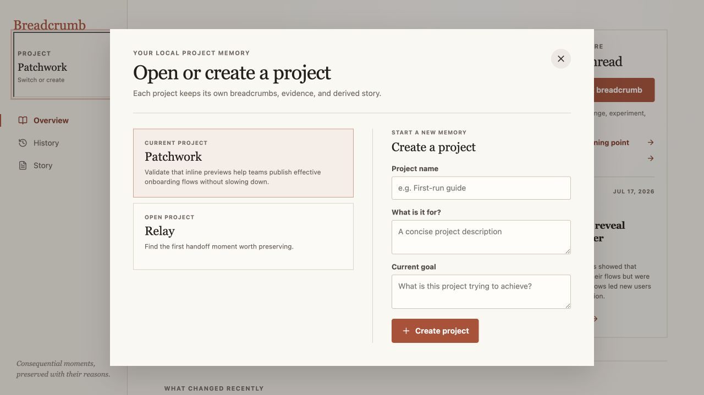
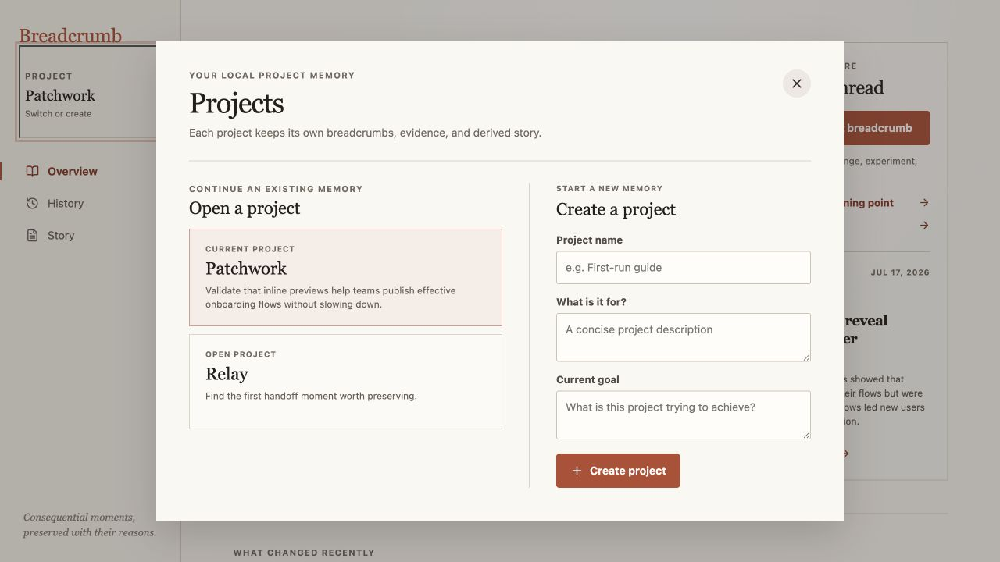
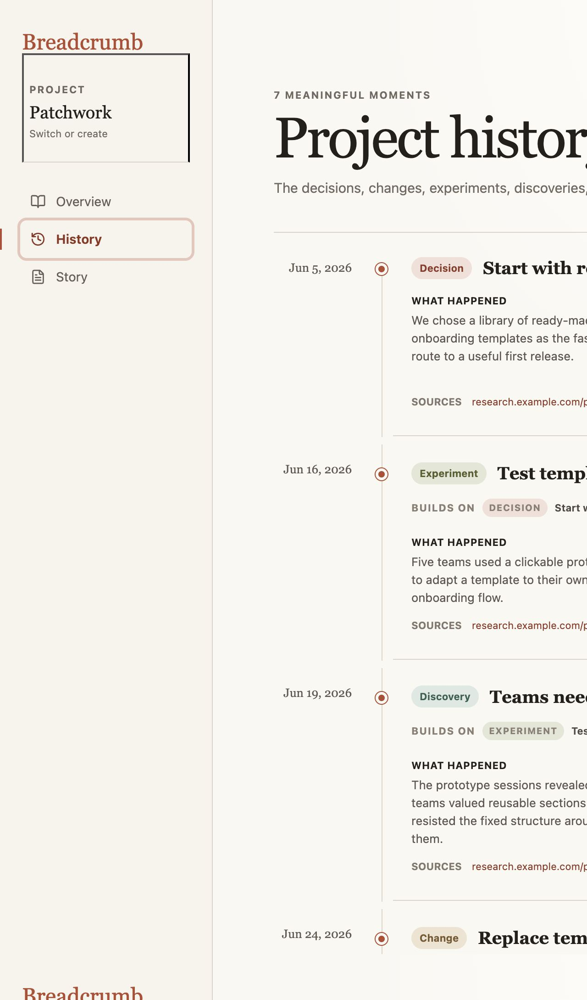
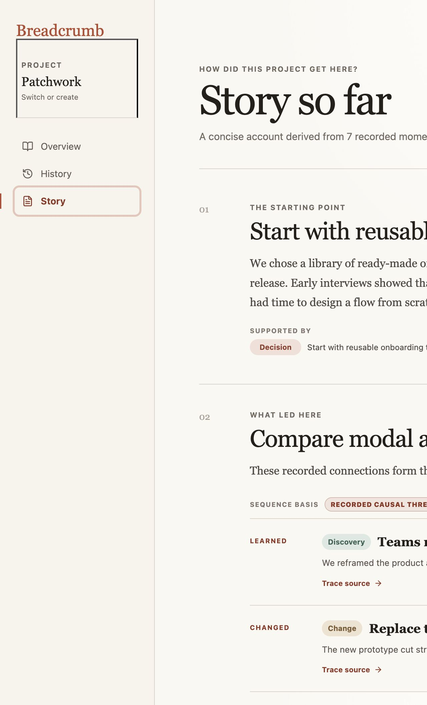
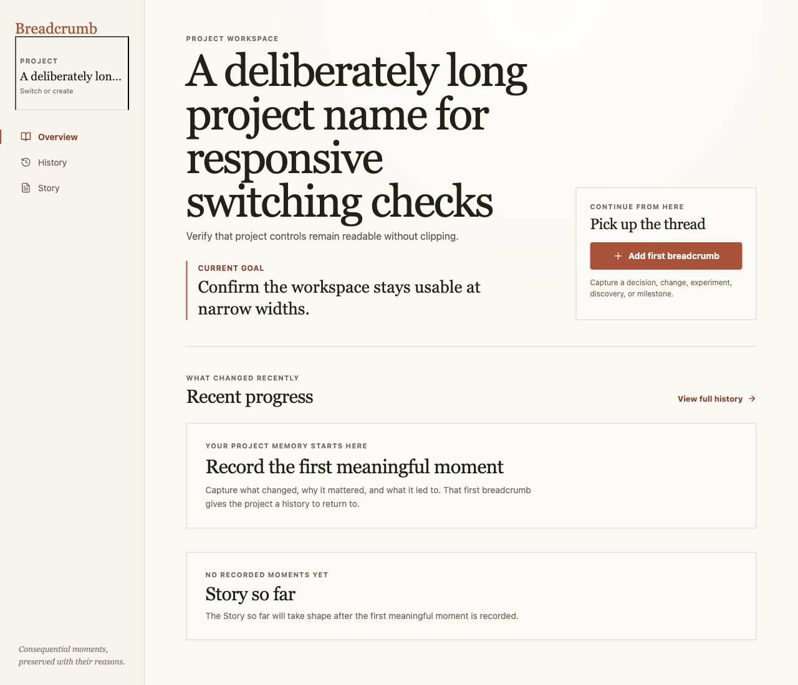

# Focused UI refinement audit

## Scope

The existing project memory flow was audited without adding product functionality:

1. choose or create a project;
2. understand the project overview;
3. review History;
4. read Story;
5. open breadcrumb capture.

## Evidence

### 1. Project overview — Healthy

The overview already has one clear primary action. Secondary actions remain textual, so the next breadcrumb stays visually dominant.

### 2. Project controls before — Needs attention

The two actions were visually separated, but the left column had no section heading and the single title made the decision less immediate.

### 3. Project controls after — Healthy

The modal now names the two tasks directly: **Open a project** for existing memory and **Create a project** for a new memory. Long names wrap inside project cards, while the active project label truncates safely in navigation.

### 4. History — Healthy

History keeps its focused page header and a single capture action. Entries remain chronological with quiet edit and trace controls.

### 5. Story — Healthy

Story retains the same page rhythm and content width as History, with trace actions visually subordinate to the narrative.

### 6. Long-name empty project — Healthy

Creating a long-name project preserved the empty state, wrapped the page heading, truncated the sidebar label, and produced no horizontal page overflow.

## Responsive checks

- Desktop browser audit: no document-level horizontal overflow at a 1280px viewport; long-name project bounds remained inside the viewport.
- Tablet rules: the existing 980px breakpoint retains the sidebar, switches the overview header to one column, and reduces gutters.
- Mobile rules: the 720px breakpoint now keeps the current-project switcher visible in the sticky header while simplifying navigation to icon controls; the 360px breakpoint moves the project control to a second row to avoid compression.
- The in-app browser exposes a fixed 1280px viewport and no viewport-emulation control, so the narrow layouts were reviewed through their active breakpoint rules rather than rendered at device dimensions in this audit.

## Accessibility limits

Visual inspection verifies labels and layout only. Keyboard focus order, escape behavior, and screen-reader announcements still need assistive-technology testing.
